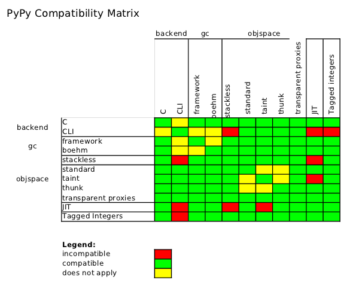

==============================
Configuration Options for PyPy
==============================

This directory contains documentation for the many `configuration`_
options that can be used to affect PyPy's behaviour.  There are two
main classes of option, `object space options`_ and `translation
options`_.

There are two main entry points that accept options: ``py.py``, which
implements Python on top of another Python interpreter and accepts all
the `object space options`_:

.. parsed-literal::

    ./py.py <`objspace options`_>

and the ``rpython/bin/rpython`` translation entry
point which takes arguments of this form:

.. parsed-literal::

    ./rpython/bin/rpython <`translation options`_> <target>

For the common case of ``<target>`` being ``targetpypystandalone.py``,
you can then pass the `object space options`_ after
``targetpypystandalone.py``, i.e. like this:

.. parsed-literal::

    ./rpython/bin/rpython <`translation options`_> targetpypystandalone.py <`objspace options`_>

There is an `overview`_ of all command line arguments that can be
passed in either position.

Many of the more interesting object space options enable optimizations,
which are described in `Standard Interpreter Optimizations`_, or allow
the creation of objects that can barely be imagined in CPython, which
are documented in `What PyPy can do for your objects`_.

The following diagram gives some hints about which PyPy features work together
with which other PyPy features:

.. _`configuration`: ../configuration.html
.. _`objspace options`: commandline.html#objspace
.. _`object space options`: commandline.html#objspace
.. _`translation options`: commandline.html#translation
.. _`overview`: commandline.html
.. _`Standard Interpreter Optimizations`: ../interpreter-optimizations.html
.. _`What PyPy can do for your objects`: ../objspace-proxies.html

.. toctree::
    :maxdepth: 2

    commandline
    translation
    objspace
    opt
