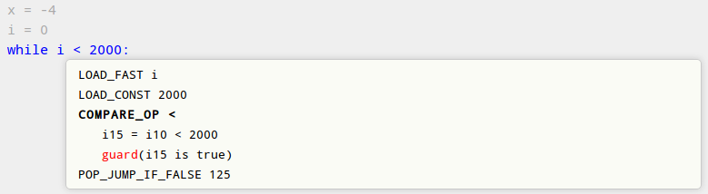

Potential Project List
======================

Getting involved
----------------

We are happy to discuss ideas around the PyPy ecosystem.
If you are interested in playing with RPython or PyPy, or have a new idea not
mentioned here please join us on irc, channel #pypy (freenode). If you are unsure,
but still think that you can make a valuable contribution to PyPy, dont
hesitate to contact us on #pypy or on our mailing list. Here are some ideas
to get you thinking:

* **Optimize PyPy Memory Usage**:  Sometimes PyPy consumes more memory than CPython.
  Two examples: 1) PyPy seems to allocate and keep alive more strings when
  importing a big Python modules.  2) The base interpreter size (cold VM started
  from a console) of PyPy is bigger than the one of CPython. The general
  procedure of this project is: Run both CPython and PyPy of the same Python
  version and compare the memory usage (using Massif or other tools).
  If PyPy consumes a lot more memory then find and resolve the issue.

* **VMProf + memory profiler**: vmprof is a statistical memory profiler. We
  want extend it with new features and resolve some current limitations.

* **VMProf visualisations**: vmprof shows a flame graph of the statistical
  profile and some more information about specific call sites. It would be
  very interesting to experiment with different information (such as memory,
  or even information generated by our jit compiler).

* **Explicit typing in RPython**: PyPy wants to have better ways to specify
  the signature and class attribute types in RPython. See more information
  about this topic below on this page.

* **Virtual Reality (VR) visualisations for vmprof**: This is a very open
  topic with lots of freedom to explore data visualisation for profiles. No
  VR hardware would be needed for this project. Either universities provide
  such hardware or in any other case we potentially can lend the VR hardware
  setup.

Simple tasks for newcomers
--------------------------

* Optimize random:
  https://foss.heptapod.net/pypy/pypy/-/issues/1901

* Implement AF_XXX packet types of sockets:
  https://foss.heptapod.net/pypy/pypy/-/issues/1942

* Help with documentation. One task would be to document rpython configuration
  options currently listed only on :doc:`this site <configuration>` also on the
  RPython_ documentation site.

.. _RPython: https://rpython.readthedocs.io/en/latest

Mid-to-large tasks
------------------

Below is a list of projects that are interesting for potential contributors
who are seriously interested in the PyPy project. They mostly share common
patterns - they're mid-to-large in size, they're usually well defined as
a standalone projects and they're not being actively worked on. For small
projects that you might want to work on look above or either look
at the `issue tracker`_, pop up on #pypy on irc.freenode.net or write to the
`mailing list`_. This is simply for the reason that small possible projects
tend to change very rapidly.

This list is mostly for having an overview on potential projects. This list is
by definition not exhaustive and we're pleased if people come up with their
own improvement ideas. In any case, if you feel like working on some of those
projects, or anything else in PyPy, pop up on IRC or write to us on the
`mailing list`_.

.. _issue tracker: https://foss.heptapod.net/pypy/pypy/-/issues
.. _mailing list: https://mail.python.org/mailman/listinfo/pypy-dev

Explicit typing in RPython
--------------------------

RPython is mostly based around type inference, but there are many cases where
specifying types explicitly is useful. We would like to be able to optionally 
specify the exact types of the arguments to any function. We already have
solutions in that space, ``@rpython.rlib.objectmodel.enforceargs`` and
``@rpython.rlib.signature.signature``, but they are inconvenient and limited. 
For instance, they do not easily allow to express the type "dict with ints as
keys and lists of instances of Foo as values".

Additionally, we would like to be able to specify the types of instance
attributes. Unlike the function case, this is likely to require some
refactoring of the annotator. 

Make bytearray type fast
------------------------

PyPy's bytearray type is very inefficient. It would be an interesting
task to look into possible optimizations on this.  (XXX current status
unknown; ask on #pypy for updates on this.)

Implement copy-on-write list slicing
------------------------------------

The idea is to have a special implementation of list objects which is used
when doing ``myslice = mylist[a:b]``: the new list is not constructed
immediately, but only when (and if) ``myslice`` or ``mylist`` are mutated.

NumPy rebooted
--------------

Our cpyext C-API compatiblity layer can now run upstream NumPy unmodified.
We need to refactor the way `NumPy adds docstrings`_.

.. _`NumPy adds docstrings`: https://github.com/numpy/numpy/issues/10167

We also are looking for help in how to hijack NumPy dtype conversion and
ufunc calls to allow the JIT to make them fast, using our internal _numpypy
module.

Improving the jitviewer
-----------------------

Analyzing performance of applications is always tricky. We have various
tools, for example a `jitviewer`_ that help us analyze performance.

The old tool was partly rewritten and combined with vmprof. The service is
hosted at `vmprof.com`_.

The following shows an old image of the jitviewer.
The code generated by the PyPy JIT in a hierarchical way:

  - at the bottom level, it shows the Python source code of the compiled loops

  - for each source code line, it shows the corresponding Python bytecode

  - for each opcode, it shows the corresponding jit operations, which are the
    ones actually sent to the backend for compiling (such as ``i15 = i10 <
    2000`` in the example)

The jitviewer is a web application based on django and angularjs:
if you have great web developing skills and want to help PyPy,
this is an ideal task to get started, because it does not require any deep
knowledge of the internals. Head over to `vmprof-python`_, `vmprof-server`_ and
`vmprof-integration`_ to find open issues and documentation.

.. _jitviewer: https://vmprof.com
.. _vmprof.com: https://vmprof.com
.. _vmprof-python: https://github.com/vmprof/vmprof-python
.. _vmprof-server: https://github.com/vmprof/vmprof-server
.. _vmprof-integration: https://github.com/vmprof/vmprof-integration

Convert RPython to Python3
--------------------------

The world is moving on, we should too. Work in this direction has begun on the
``rpython3`` branch, mainly to enable building documentation with Python3. Some
things that are known to need careful refactoring:

- a single character in python3 is an int, not a byte
- we use ``str``/``unicode`` to distiguish between different modes of
  operation for windows in ``make_win32_traits``.

There are probably more. The branch currently does not pass rpython tests so
work is needed to back out some of the changes and redo them properly

Improve performance
-------------------

* Make uninlined Python-level calls faster
* Switch to a `sea-of-nodes`_ IR, or a `Lua-Jit`_-like IR which iterates on
  on the sea-of-nodes approach
* Use real register-allocation
* Improve instruction selection / scheduling 
* Create a hybrid tracing/method JIT

.. _`sea-of-nodes`: https://darksi.de/d.sea-of-nodes/
.. _`Lua-JIT`: http://wiki.luajit.org/SSA-IR-2.0

Improve warmup
--------------
* Interpreter speed-ups
* Optimize while tracing
* Cache information between runs

Translation Toolchain
---------------------

(XXX this is unlikely to be feasible.)

* Incremental or distributed translation.
* Allow separate compilation of extension modules.

Various GCs
-----------

PyPy has pluggable garbage collection policy. This means that various garbage
collectors can be written for specialized purposes, or even various
experiments can be done for the general purpose. Examples:

* A garbage collector that compact memory better for mobile devices
* A concurrent garbage collector (a lot of work)
* A collector that keeps object flags in separate memory pages, to avoid
  un-sharing all pages between several fork()ed processes

STM (Software Transactional Memory)
-----------------------------------

This is work in progress.  Besides the main development path, whose goal is
to make a (relatively fast) version of pypy which includes STM, there are
independent topics that can already be experimented with on the existing,
JIT-less pypy-stm version:

* What kind of conflicts do we get in real use cases?  And, sometimes,
  which data structures would be more appropriate?  For example, a dict
  implemented as a hash table will suffer "stm collisions" in all threads
  whenever one thread writes anything to it; but there could be other
  implementations.  Maybe alternate strategies can be implemented at the
  level of the Python interpreter (see list/dict strategies,
  ``pypy/objspace/std/{list,dict}object.py``).
* More generally, there is the idea that we would need some kind of
  "debugger"-like tool to "debug" things that are not bugs, but stm
  conflicts.  How would this tool look like to the end Python
  programmers?  Like a profiler?  Or like a debugger with breakpoints
  on aborted transactions?  It would probably be all app-level, with
  a few hooks e.g. for transaction conflicts.
* Find good ways to have libraries using internally threads and atomics,
  but not exposing threads to the user.  Right now there is a rough draft
  in ``lib_pypy/transaction.py``, but much better is possible.  For example
  we could probably have an iterator-like concept that allows each loop
  iteration to run in parallel.

Introduce new benchmarks
------------------------

Our benchmark runner_ is showing its age. We should merge with the `CPython site`_

Additionally, we're usually happy to introduce new benchmarks. Please consult us
before, but in general something that's real-world python code
and is not already represented is welcome. We need at least a standalone
script that can run without parameters. Example ideas (benchmarks need
to be got from them!):

* `hg`

.. _runner: https://speed.pypy.org
.. _`CPython site`: https://speed.python.org/

Interfacing with C
------------------

While we could make ``cpyext`` faster_, we would also like to explore other
ideas. It seems cffi is only appropriate for small to medium-sized extensions,
and it is hard to imagine NumPy abandoning the C-API. Here are a few ideas:
* Extend Cython to have a backend that can be understood by the JIT
* Collaborate with C-extension authors to ensure full PyPy support (see below)
* Put PyPy compatible packages on PyPI and in conda

.. _faster: https://morepypy.blogspot.com/2018/09#next-steps

Support more platforms
----------------------

We have a plan for a `Windows 64`_ port. There is progress on the ``win64``
branch. Help is needed to continue the work. Stage I is complete: we now have
a 64-bit PyPy2.7 on windows. But it is missing cpyext and other tidbits to
enable releasing it.

.. _`Windows 64`: windows.html#what-is-missing-for-a-full-64-bit-translation

======================================
Make more python modules pypy-friendly
======================================

A lot of work has gone into PyPy's implementation of CPython's C-API, cpyext,
over the last years to let it reach a practical level of compatibility, so that
C extensions for CPython work on PyPy without major rewrites. However, there
are still many edges and corner cases where it misbehaves.

For any popular extension that does not already advertise full PyPy
compatibility, it would thus be useful to take a close look at it in order to
make it fully compatible with PyPy. The general process is something like:

* Run the extension's tests on PyPy and look at the test failures.
* Some of the failures may be solved by identifying cases where the extension
  relies on undocumented or internal details of CPython, and rewriting the
  relevant code to follow documented best practices. Open issues and send pull
  requests as appropriate given the extension's development process.
* Other failures may highlight incompatibilities between cpyext and CPython.
  Please report them to us and try to fix them.
* Run benchmarks, either provided by the extension developers or created by
  you. Any case where PyPy is significantly slower than CPython is to be
  considered a bug and solved as above.

Alternatively, an approach we used to recommend was to rewrite C extensions
using more pypy-friendly technologies, e.g. cffi. Here is a partial list of
good work that needs to be finished:

**wxPython-cffi** `archived copy of the bitbucket repo`_

    Status: A project by a PyPy developer to adapt the Phoenix sip build system to cffi

    The project is a continuation of a 2013 GSOC https://waedt.blogspot.com/

    TODO: Revive the archive, merge the latest version of the wrappers and finish
    the sip conversion

.. _`archived copy of the bitbucket repo`: https://bitbucket-archive.softwareheritage.org/projects/am/amauryfa/wxpython-cffi.html

**pygame** https://github.com/CTPUG/pygame_cffi

    Status: see blog post <https://morepypy.blogspot.com/2014/03/pygamecffi-pygame-on-pypy.html>

    TODO: see the end of the blog post

Work has begun on HPy_ to enable a faster C-API.

.. _HPy: https://hpy.readthedocs.io/en/latest/
