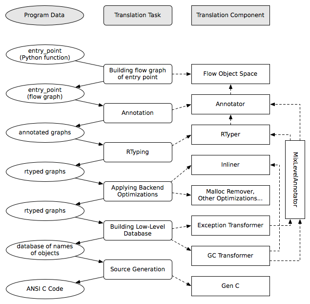

The RPython Toolchain
=====================

.. contents::

This document describes the toolchain that we have developed to analyze
and "compile" RPython programs (like PyPy itself) to various target
platforms.

It consists of three broad sections: a slightly simplified overview, a
brief introduction to each of the major components of our toolchain and
then a more comprehensive section describing how the pieces fit together.
If you are reading this document for the first time, the Overview_ is
likely to be most useful, if you are trying to refresh your PyPy memory
then the `How It Fits Together`_ is probably what you want.

Overview
--------

The job of the translation toolchain is to translate RPython programs into an
efficient version of that program for one of various target platforms,
generally one that is considerably lower-level than Python.  It divides
this task into several steps, and the purpose of this document is to
introduce them.

To start with we describe the process of translating an :ref:`RPython <language>` program into
C (which is the default and original target).

.. _initialization-time:

The RPython translation toolchain never sees Python source code or syntax
trees, but rather starts with the *code objects* that define the
behaviour of the function objects one gives it as input.  The
:ref:`flow graph builder<flow-graphs>` works through these
code objects using `abstract interpretation`_ to produce a control
flow graph (one per function): yet another representation of the
source program, but one which is suitable for applying type inference
and translation techniques and which is the fundamental data structure
most of the translation steps operate on.

It is helpful to consider translation as being made up of the following
steps (see also the figure below):

1. The complete program is imported, at which time arbitrary run-time
   initialization can be performed.  Once this is done, the program must
   be present in memory as a form that is "static enough" in the sense of
   :doc:`RPython <rpython>`.

2. The Annotator_ performs a global analysis starting from a specified
   entry point to deduce type and other information about what each
   variable can contain at run-time, :ref:`building flow graphs <flow-graphs>`
   as it encounters them.

3. The :ref:`RPython Typer <rtyper>` (or RTyper) uses the high-level
   information inferred by the Annotator to turn the operations in the control
   flow graphs into low-level operations.

4. After the RTyper there are several optional `optimizations`_ which can be
   applied and are intended to make the resulting program go faster.

5. The next step is `preparing the graphs for source generation`_, which
   involves computing the names that the various functions and types in
   the program will have in the final source and applying transformations
   which insert explicit exception handling and memory management
   operations.

6. `The C backend`_ (colloquially known as "GenC") produces a number of C
   source files (as noted above, we are ignoring the other backends for
   now).

7. These source files are compiled to produce an executable.

(although these steps are not quite as distinct as you might think from
this presentation).

There is an :ref:`interactive interface <try-out-the-translator>` called :source:`rpython/bin/translatorshell.py` to the
translation process which allows you to interactively work through these
stages.

The following figure gives a simplified overview (`PDF color version`_):

    .. image:: _static/translation-greyscale-small.png

.. _PDF color version: _static/translation.pdf
.. _abstract interpretation: http://en.wikipedia.org/wiki/Abstract_interpretation

.. _flow-graphs:

Building Flow Graphs
--------------------

Introduction
~~~~~~~~~~~~

The task of the flow graph builder (the source is at :source:`rpython/flowspace/`)
is to generate a control-flow graph from a function.  This graph will also
contain a trace of the individual operations, so that it is actually just an
alternate representation for the function.

The basic idea is that if an interpreter is given a function, e.g.::

  def f(n):
    return 3*n+2

it will compile it to bytecode and then execute it on its VM.
Instead, the flow graph builder contains an `abstract interpreter`_ which takes the bytecode
and performs whatever stack-shuffling and variable juggling is needed, but
merely records any actual operation performed on a Python object into
a structure called a basic block. The result of the operation is represented by a
placeholder value that can appear in further operations.

.. _abstract interpreter: http://en.wikipedia.org/wiki/Abstract_interpretation

For example, if the placeholder ``v1`` is given as the argument to the above
function, the bytecode interpreter will call ``v2 = space.mul(space.wrap(3),
v1)`` and then ``v3 = space.add(v2, space.wrap(2))`` and return ``v3`` as the
result.  During these calls, the following block is recorded::

  Block(v1):     # input argument
    v2 = mul(Constant(3), v1)
    v3 = add(v2, Constant(2))

Abstract interpretation
~~~~~~~~~~~~~~~~~~~~~~~

``build_flow()`` works by recording all operations issued by the bytecode
interpreter into basic blocks.  A basic block ends in one of two cases: when
the bytecode interpreters calls ``is_true()``, or when a joinpoint is reached.

* A joinpoint occurs when the next operation is about to be recorded into the
  current block, but there is already another block that records an operation
  for the same bytecode position.  This means that the bytecode interpreter
  has closed a loop and is interpreting already-seen code again.  In this
  situation, we interrupt the bytecode interpreter and we make a link from the
  end of the current block back to the previous block, thus closing the loop
  in the flow graph as well.  (Note that this occurs only when an operation is
  about to be recorded, which allows some amount of constant-folding.)

* If the bytecode interpreter calls ``is_true()``, the abstract interpreter doesn't
  generally know if the answer should be True or False, so it puts a
  conditional jump and generates two successor blocks for the current basic
  block.  There is some trickery involved so that the bytecode interpreter is
  fooled into thinking that ``is_true()`` first returns False (and the
  subsequent operations are recorded in the first successor block), and later
  the *same* call to ``is_true()`` also returns True (and the subsequent
  operations go this time to the other successor block).

(This section to be extended...)

.. _flow-model:

The Flow Model
--------------

Here we describe the data structures produced by ``build_flow()``, which are
the basic data structures of the translation process.

All these types are defined in :source:`rpython/flowspace/model.py` (which is a
rather important module in the PyPy source base, to reinforce the point).

The flow graph of a function is represented by the class ``FunctionGraph``.
It contains a reference to a collection of ``Block``\ s connected by ``Link``\ s.

A ``Block`` contains a list of ``SpaceOperation``\ s.  Each ``SpaceOperation``
has an ``opname`` and a list of ``args`` and ``result``, which are either
``Variable``\ s or ``Constant``\ s.

We have an extremely useful PyGame viewer, which allows you to visually
inspect the graphs at various stages of the translation process (very
useful to try to work out why things are breaking).  It looks like this:

   .. image:: _static/bpnn_update.png

It is recommended to play with ``python bin/translatorshell.py`` on a few
examples to get an idea of the structure of flow graphs. The following describes
the types and their attributes in some detail:

``FunctionGraph``
    A container for one graph (corresponding to one function).

    :startblock:   the first block.  It is where the control goes when the
                   function is called.  The input arguments of the startblock
                   are the function's arguments.  If the function takes a
                   ``*args`` argument, the ``args`` tuple is given as the last
                   input argument of the startblock.

    :returnblock:  the (unique) block that performs a function return.  It is
                   empty, not actually containing any ``return`` operation; the
                   return is implicit.  The returned value is the unique input
                   variable of the returnblock.

    :exceptblock:  the (unique) block that raises an exception out of the
                   function.  The two input variables are the exception class
                   and the exception value, respectively.  (No other block will
                   actually link to the exceptblock if the function does not
                   explicitly raise exceptions.)

``Block``
    A basic block, containing a list of operations and ending in jumps to other
    basic blocks.  All the values that are "live" during the execution of the
    block are stored in Variables.  Each basic block uses its own distinct
    Variables.

    :inputargs:   list of fresh, distinct Variables that represent all the
                  values that can enter this block from any of the previous
                  blocks.

    :operations:  list of SpaceOperations.
    :exitswitch:  see below

    :exits:       list of Links representing possible jumps from the end of this
                  basic block to the beginning of other basic blocks.

    Each Block ends in one of the following ways:

    * unconditional jump: exitswitch is None, exits contains a single Link.

    * conditional jump: exitswitch is one of the Variables that appear in the
      Block, and exits contains one or more Links (usually 2).  Each Link's
      exitcase gives a concrete value.  This is the equivalent of a "switch":
      the control follows the Link whose exitcase matches the run-time value of
      the exitswitch Variable.  It is a run-time error if the Variable doesn't
      match any exitcase.

    * exception catching: exitswitch is ``Constant(last_exception)``.  The first
      Link has exitcase set to None and represents the non-exceptional path.
      The next Links have exitcase set to a subclass of Exception, and are taken
      when the *last* operation of the basic block raises a matching exception.
      (Thus the basic block must not be empty, and only the last operation is
      protected by the handler.)

    * return or except: the returnblock and the exceptblock have operations set
      to an empty tuple, exitswitch to None, and exits empty.

``Link``
    A link from one basic block to another.

    :prevblock:  the Block that this Link is an exit of.

    :target:     the target Block to which this Link points to.

    :args:       a list of Variables and Constants, of the same size as the
                 target Block's inputargs, which gives all the values passed
                 into the next block.  (Note that each Variable used in the
                 prevblock may appear zero, one or more times in the ``args``
                 list.)

    :exitcase:   see above.

    :last_exception: None or a Variable; see below.

    :last_exc_value: None or a Variable; see below.

    Note that ``args`` uses Variables from the prevblock, which are matched to
    the target block's ``inputargs`` by position, as in a tuple assignment or
    function call would do.

    If the link is an exception-catching one, the ``last_exception`` and
    ``last_exc_value`` are set to two fresh Variables that are considered to be
    created when the link is entered; at run-time, they will hold the exception
    class and value, respectively.  These two new variables can only be used in
    the same link's ``args`` list, to be passed to the next block (as usual,
    they may actually not appear at all, or appear several times in ``args``).

``SpaceOperation``
    A recorded (or otherwise generated) basic operation.

    :opname:  the name of the operation. ``build_flow()`` produces only operations
              from the list in ``rpython.flowspace.operation``, but later the
              names can be changed arbitrarily.

    :args:    list of arguments.  Each one is a Constant or a Variable seen
              previously in the basic block.

    :result:  a *new* Variable into which the result is to be stored.

    Note that operations usually cannot implicitly raise exceptions at run-time;
    so for example, code generators can assume that a ``getitem`` operation on a
    list is safe and can be performed without bound checking.  The exceptions to
    this rule are: (1) if the operation is the last in the block, which ends
    with ``exitswitch == Constant(last_exception)``, then the implicit
    exceptions must be checked for, generated, and caught appropriately; (2)
    calls to other functions, as per ``simple_call`` or ``call_args``, can
    always raise whatever the called function can raise --- and such exceptions
    must be passed through to the parent unless they are caught as above.

``Variable``
    A placeholder for a run-time value.  There is mostly debugging stuff here.

    :name:  it is good style to use the Variable object itself instead of its
            ``name`` attribute to reference a value, although the ``name`` is
            guaranteed unique.

``Constant``
    A constant value used as argument to a SpaceOperation, or as value to pass
    across a Link to initialize an input Variable in the target Block.

    :value:  the concrete value represented by this Constant.
    :key:    a hashable object representing the value.

    A Constant can occasionally store a mutable Python object.  It represents a
    static, pre-initialized, read-only version of that object.  The flow graph
    should not attempt to actually mutate such Constants.

.. _annotator:

The Annotation Pass
-------------------

We describe briefly below how a control flow graph can be "annotated" to
discover the types of the objects.  This annotation pass is a form of type
inference.  It operates on the control flow graphs built by the Flow
Object Space.

For a more comprehensive description of the annotation process, see the
corresponding section of our `EU report about translation`_.

The major goal of the annotator is to "annotate" each variable that
appears in a flow graph.  An "annotation" describes all the possible
Python objects that this variable could contain at run-time, based on a
whole-program analysis of all the flow graphs -- one per function.

An "annotation" is an instance of a subclass of ``SomeObject``.  Each
subclass that represents a specific family of objects.

Here is an overview (see ``pypy/annotation/model/``):

* ``SomeObject`` is the base class.  An instance of ``SomeObject()``
  represents any Python object, and as such usually means that the input
  program was not fully RPython.

* ``SomeInteger()`` represents any integer.  ``SomeInteger(nonneg=True)``
  represent a non-negative integer (``>=0``).

* ``SomeString()`` represents any string; ``SomeChar()`` a string of
  length 1.

* ``SomeTuple([s1,s2,..,sn])`` represents a tuple of length ``n``.  The
  elements in this tuple are themselves constrained by the given list of
  annotations.  For example, ``SomeTuple([SomeInteger(), SomeString()])``
  represents a tuple with two items: an integer and a string.

The result of the annotation pass is essentially a large dictionary
mapping ``Variable``\ s to annotations.

All the ``SomeXxx`` instances are immutable.  If the annotator needs to
revise its belief about what a Variable can contain, it does so creating a
new annotation, not mutating the existing one.

.. _EU report about translation: https://bitbucket.org/pypy/extradoc/raw/tip/eu-report/D05.1_Publish_on_translating_a_very-high-level_description.pdf

Mutable Values and Containers
~~~~~~~~~~~~~~~~~~~~~~~~~~~~~

Mutable objects need special treatment during annotation, because
the annotation of contained values needs to be possibly updated to account
for mutation operations, and consequently the annotation information
reflown through the relevant parts of the flow graphs.

* ``SomeList`` stands for a list of homogeneous type (i.e. all the
  elements of the list are represented by a single common ``SomeXxx``
  annotation).

* ``SomeDict`` stands for a homogeneous dictionary (i.e. all keys have
  the same ``SomeXxx`` annotation, and so have all values).

User-defined Classes and Instances
~~~~~~~~~~~~~~~~~~~~~~~~~~~~~~~~~~

``SomeInstance`` stands for an instance of the given class or any
subclass of it.  For each user-defined class seen by the annotator, we
maintain a ClassDef (``pypy.annotation.classdef``) describing the
attributes of the instances of the class; essentially, a ClassDef gives
the set of all class-level and instance-level attributes, and for each
one, a corresponding ``SomeXxx`` annotation.

Instance-level attributes are discovered progressively as the annotation
progresses.  Assignments like::

   inst.attr = value

update the ClassDef of the given instance to record that the given
attribute exists and can be as general as the given value.

For every attribute, the ClassDef also records all the positions where
the attribute is *read*.  If, at some later time, we discover an
assignment that forces the annotation about the attribute to be
generalized, then all the places that read the attribute so far are
marked as invalid and the annotator will restart its analysis
from there.

The distinction between instance-level and class-level attributes is
thin; class-level attributes are essentially considered as initial
values for instance-level attributes.  Methods are not special in this
respect, except that they are bound to the instance (i.e. ``self =
SomeInstance(cls)``) when considered as the initial value for the
instance.

The inheritance rules are as follows: the union of two ``SomeInstance``
annotations is the ``SomeInstance`` of the most precise common base
class.  If an attribute is considered (i.e. read or written) through a
``SomeInstance`` of a parent class, then we assume that all subclasses
also have the same attribute, and that the same annotation applies to
them all (so code like ``return self.x`` in a method of a parent class
forces the parent class and all its subclasses to have an attribute
``x``, whose annotation is general enough to contain all the values that
all the subclasses might want to store in ``x``).  However, distinct
subclasses can have attributes of the same names with different,
unrelated annotations if they are not used in a general way through the
parent class.

The RPython Typer
-----------------

See :doc:`rtyper`.

.. _optimizations:

Backend Optimizations
---------------------

The point of the backend optimizations are to make the compiled program run
faster.  Compared to many parts of the PyPy translator, which are very unlike
a traditional compiler, most of these will be fairly familiar to people who
know how compilers work.

Function Inlining
~~~~~~~~~~~~~~~~~

To reduce the overhead of the many function calls that occur when running the
PyPy interpreter we implemented function inlining. This is an optimization
which takes a flow graph and a callsite and inserts a copy of the flow graph
into the graph of the calling function, renaming occurring variables as
appropriate. This leads to problems if the original function was surrounded by
a ``try: ... except: ...`` guard. In this case inlining is not always
possible.  If the called function is not directly raising an exception (but an
exception is potentially raised by further called functions) inlining is safe,
though.

In addition we also implemented heuristics which function to inline where. For
this purpose we assign every function a "size". This size should roughly
correspond to the increase in code-size which is to be expected should the
function be inlined somewhere. This estimate is the sum of two numbers: for
one every operations is assigned a specific weight, the default being a weight
of one. Some operations are considered to be more effort than others,
e.g. memory allocation and calls; others are considered to be no effort at all
(casts...). The size estimate is for one the sum of the weights of all
operations occurring in the graph. This is called the "static instruction
count". The other part of the size estimate of a graph is the "median
execution cost". This is again the sum of the weight of all operations in the
graph, but this time weighted with a guess how often the operation is
executed. To arrive at this guess we assume that at every branch we take both
paths equally often, except for branches that are the end of loops, where the
jump back to the end of the loop is considered more likely.  This leads to a
system of equations which can be solved to get approximate weights for all
operations.

After the size estimate for all function has been determined, functions are
being inlined into their callsites, starting from the smallest functions. Every
time a function is being inlined into another function, the size of the outer
function is recalculated. This is done until the remaining functions all have a
size greater than a predefined limit.

Malloc Removal
~~~~~~~~~~~~~~

Since RPython is a garbage collected language there is a lot of heap memory
allocation going on all the time, which would either not occur at all in a more
traditional explicitly managed language or results in an object which dies at
a time known in advance and can thus be explicitly deallocated. For example a
loop of the following form::

    for i in range(n):
        ...

which simply iterates over all numbers from 0 to n - 1 is equivalent to the
following in Python::

    l = range(n)
    iterator = iter(l)
    try:
        while 1:
            i = iterator.next()
            ...
    except StopIteration:
        pass

Which means that three memory allocations are executed: The range object, the
iterator for the range object and the StopIteration instance, which ends the
loop.

After a small bit of inlining all these three objects are never even passed as
arguments to another function and are also not stored into a globally reachable
position. In such a situation the object can be removed (since it would die
anyway after the function returns) and can be replaced by its contained values.

This pattern (an allocated object never leaves the current function and thus
dies after the function returns) occurs quite often, especially after some
inlining has happened. Therefore we implemented an optimization which
"explodes" objects and thus saves one allocation in this simple (but quite
common) situation.

Escape Analysis and Stack Allocation
~~~~~~~~~~~~~~~~~~~~~~~~~~~~~~~~~~~~

Another technique to reduce the memory allocation penalty is to use stack
allocation for objects that can be proved not to life longer than the stack
frame they have been allocated in.  This proved not to really gain us any
speed, so over time it was removed again.

.. _preparing the graphs for source generation:

Preparation for Source Generation
---------------------------------

This, perhaps slightly vaguely named, stage is the most recent to appear as a
separate step.  Its job is to make the final implementation decisions before
source generation -- experience has shown that you really don't want to be
doing *any* thinking at the same time as actually generating source code.  For
the C backend, this step does three things:

 - inserts explicit exception handling,

 - inserts explicit memory management operations,

 - decides on the names functions and types will have in the final
   source (this mapping of objects to names is sometimes referred to as
   the "low-level database").

Making Exception Handling Explicit
~~~~~~~~~~~~~~~~~~~~~~~~~~~~~~~~~~

RPython code is free to use exceptions in much the same way as unrestricted
Python, but the final result is a C program, and C has no concept of
exceptions.  The exception transformer implements exception handling in a
similar way to CPython: exceptions are indicated by special return values and
the current exception is stored in a global data structure.

In a sense the input to the exception transformer is a program in terms of the
:term:`lltypesystem` with exceptions and the output is a program in terms of the bare
lltypesystem.

Memory Management Details
~~~~~~~~~~~~~~~~~~~~~~~~~

As well as featuring exceptions, RPython is a garbage collected language;
again, C is not.  To square this circle, decisions about memory management
must be made.  In keeping with PyPy's approach to flexibility, there is
freedom to change how to do it.  There are three approaches implemented today:

 - reference counting (deprecated, too slow)
 - using the `Boehm-Demers-Weiser conservative garbage collector`_
 - using one of our custom :doc:`exact GCs implemented in RPython <garbage_collection>`

.. _Boehm-Demers-Weiser conservative garbage collector: http://hboehm.info/gc/

Almost all application-level Python code allocates objects at a very fast
rate; this means that the memory management implementation is critical to the
performance of the PyPy interpreter.

.. _genc:

The C Backend
--------------

:source:`rpython/translator/c/`

This is currently the sole code generation backend.

A Historical Note
-----------------

As this document has shown, the translation step is divided into more
steps than one might at first expect.  It is certainly divided into more
steps than we expected when the project started; the very first version of
GenC operated on the high-level flow graphs and the output of the
annotator, and even the concept of the RTyper didn't exist yet.  More
recently, the fact that preparing the graphs for source generation
("databasing") and actually generating the source are best considered
separately has become clear.

How It Fits Together
--------------------

As should be clear by now, the translation toolchain of PyPy is a flexible
and complicated beast, formed from many separate components.

.. digraph:: translation

   graph [fontname = "Sans-Serif", size="6.00"]
   node [fontname = "Sans-Serif"]
   edge [fontname = "Sans-Serif"]

   subgraph legend {
     "Input or Output" [shape=ellipse, style=filled]
     "Transformation Step" [shape=box, style="rounded,filled"]
     // Invisible egde to make sure they are placed vertically
     "Input or Output" -> "Transformation Step" [style=invis]
   }

   "Input Program" [shape=ellipse]
   "Flow Analysis" [shape=box, style=rounded]
   "Annotator" [shape=box, style=rounded]
   "RTyper" [shape=box, style=rounded]
   "Backend Optimizations (optional)" [shape=box, style=rounded]
   "Exception Transformer" [shape=box, style=rounded]
   "GC Transformer" [shape=box, style=rounded]
   "GenC" [shape=box, style=rounded]
   "ANSI C code" [shape=ellipse]

   "Input Program" -> "Flow Analysis" -> "Annotator" -> "RTyper"
   -> "Backend Optimizations (optional)" -> "Exception Transformer"
   -> "GC Transformer"
   "RTyper" -> "Exception Transformer" [style=dotted]
   "GC Transformer" -> "GenC" -> "ANSI C code"
   // "GC Transformer" -> "GenLLVM" -> "LLVM IR"

A detail that has not yet been emphasized is the interaction of the
various components.  It makes for a nice presentation to say that
after the annotator has finished the RTyper processes the graphs and
then the exception handling is made explicit and so on, but it's not
entirely true.  For example, the RTyper inserts calls to many
:term:`low-level helper`\ s which must first be annotated, and the GC
transformer can use inlining (one of the `backend optimizations`_) of
some of its small helper functions to improve performance.  The
following picture attempts to summarize the components involved in
performing each step of the default translation process:

A component not mentioned before is the "MixLevelAnnotator"; it
provides a convenient interface for a "late" (after RTyping)
translation step to declare that it needs to be able to call each of a
collection of functions (which may refer to each other in a mutually
recursive fashion) and annotate and rtype them all at once.
